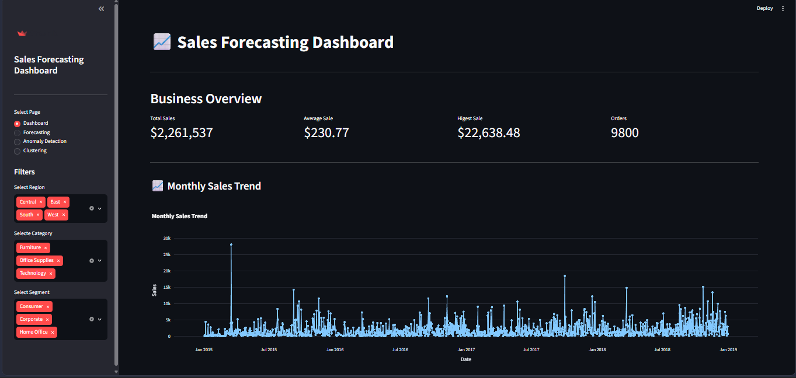
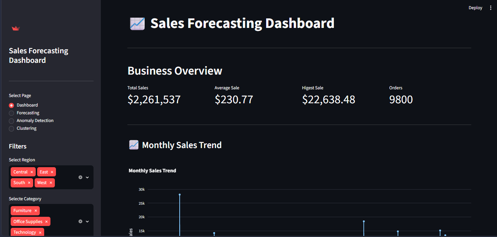
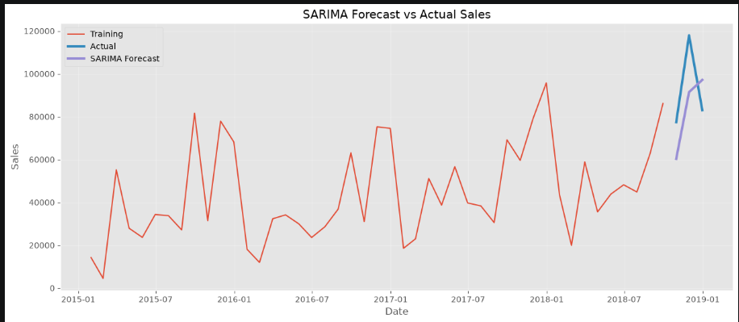
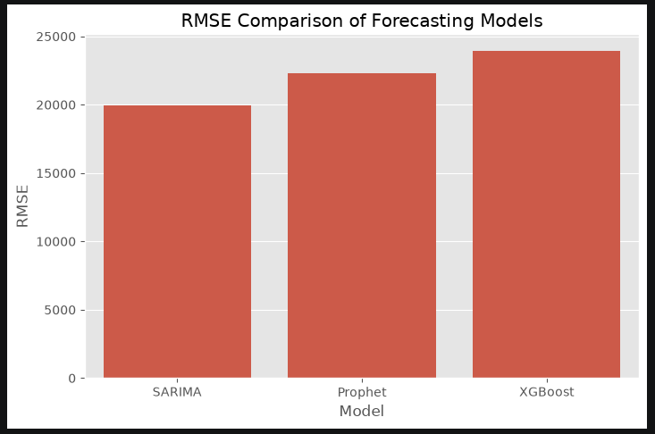

# 📈 Sales Forecasting Dashboard

An interactive Sales Forecasting Dashboard built using Python, Machine Learning, and Streamlit. The application predicts future sales based on historical data and provides interactive visualizations for business analysis.

---

## 🚀 Features

- Data Cleaning & Preprocessing
- Sales Trend Analysis
- Interactive Dashboard using Streamlit
- Sales Forecasting
- Download Forecast Results
- Dynamic Charts
- User-Friendly Interface

---

## 🛠️ Technologies Used

- Python
- Pandas
- NumPy
- Matplotlib
- Scikit-Learn
- Streamlit

---

## 📂 Project Structure

```text
app.py
sales_forecasting.ipynb
requirements.txt
README.md
sales_data.csv
```

---

## ⚙️ Installation

Clone the repository

```bash
git clone https://github.com/YOUR_USERNAME/SalesForecasting_OmprakashMeena.git
```

Go to project folder

```bash
cd SalesForecasting_OmprakashMeena
```

Install dependencies

```bash
pip install -r requirements.txt
```

Run the application

```bash
python -m streamlit run app.py
```

---

# Dashboard Preview

### Home Page



### Dashboard



### Forecast



### Prediction



## 📌 Future Improvements

- Multiple Forecasting Models
- Model Comparison
- Cloud Deployment
- Live Data Integration

---

## 👤 Author

**Omprakash Meena**

B.Tech CSE (Data Science)

SOIT RGPV RGPV Bhopal
